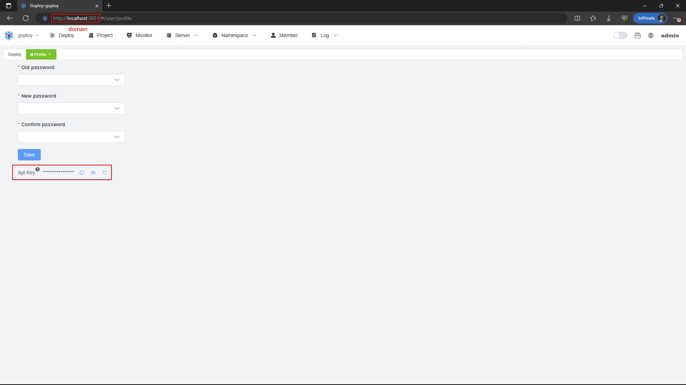
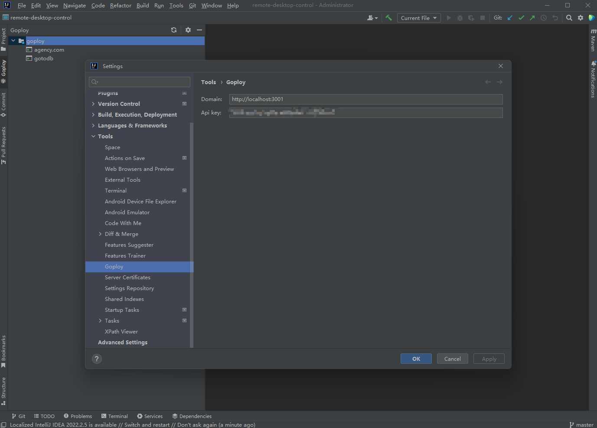

# Goploy Extension for Jetbrains

Name: go + deploy

A web deployment system tool!

Support all kinds of code release and rollback, which can be done through the web with one click!

Complete installation instructions, no difficulty in getting started!

## Install

1. Install a compatible JetBrains IDE, such as IntelliJ IDEA, CLion, PyCharm, or other IntelliJ-based IDEs
2. Launch the IDE and open plugin settings
3. Search for Goploy and click install
4. Set the configure in tools settings

## Extension Settings

This extension contributes the following settings:

* `goploy.apiKey`: goploy api key
* `goploy.domain`: goploy domain like https://example.com

## Features

Use Goploy to automate your development workflow, so you can focus on work that matters most.

Goploy is commonly used for:

- Building projects

## Extension Settings

This extension contributes the following settings:

* `goploy.apiKey`: goploy api key
* `goploy.domain`: goploy domain like https://example.com

## Preview

### For more information

* [Goploy](https://github.com/zhenorzz/goploy)
* [Website](https://www.goploy.icu)
* [Document](https://docs.goploy.icu)
